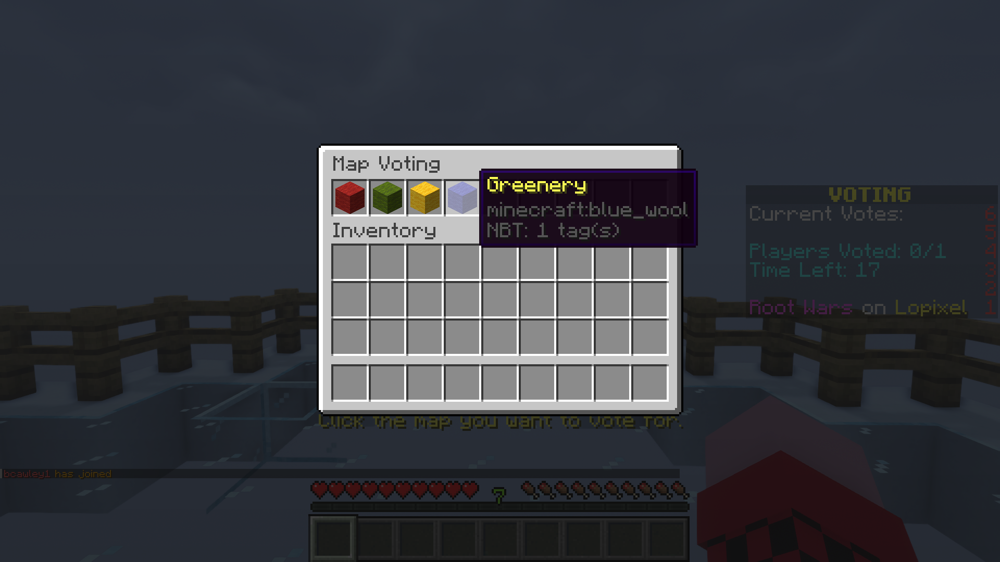
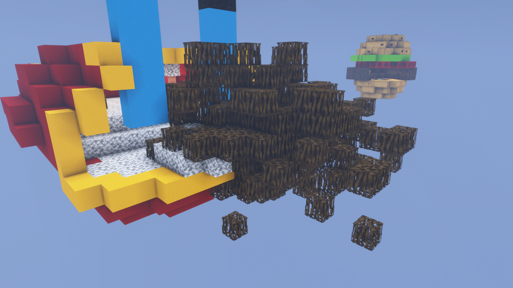
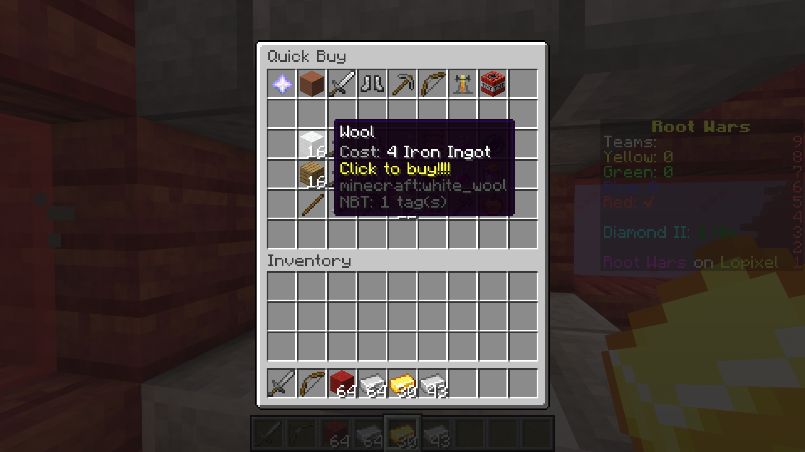
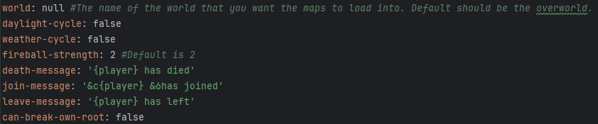

# Root Wars
## A Minecraft server plugin using the [Spigot API](https://www.spigotmc.org/), that brings a fun PvP based minigame to your server.

## Features
- **Voting System:** Players can vote for the map and game mode that they would like to play. The item with the most amount of votes wins and is automatically selected for next game.
  
    

- **Custom Maps:** Using the WorldEdit API, custom maps are allowed to be loaded from `.schem` files as well as having important data stored in a JSON file.
  
    
 
- **Unique Game Modes:** Many game modes are available for players to play with. They allow for Root Wars to be played in many new ways, while still keeping the core concepts the same.

    

- **Generators And Shops:** Generators allow for players to gain resources that they can share with their team in order to buy items from the shop that can assist them.

    

- **Customizability:** Through the use of a `config.yml` file, server owners can customize data related to the gameplay such as fireball strength, and whether a player should be able to break their own root.

    

## Installation
1. Download the Root Wars plugin JAR file from the releases section of this repository.
2. Place the downloaded JAR file into the 'plugins' folder of your Minecraft server running Spigot or Paper.
3. Ensure that you have the latest version of the WorldEdit plugin installed as well.
4. Restart your server to enable the plugin.
## Dependencies
- The latest version of [WorldEdit](https://enginehub.org/worldedit).
## Configuration
- ### Many global variables can be configured through the `config.yml` file in the plugin's install location.
- `world` - The world that the plugin should play Root War in. Default should be the over world.
- `daylight-cycle` - Whether time should pass.
- `weather-cycle` - Whether weather events should happen.
- `fireball-strength` - The power of fireball explosions, default is 2.
- `death-message` - Death message for players. Use `{player}` to have the players name. Supports regular Minecraft color codes.
- `join-message` - Join message for players. Use `{player}` to have the players name. Supports regular Minecraft color codes.
- `leave-message` - Leave message for players. Use `{player}` to have the players name. Supports regular Minecraft color codes.
- `can-break-own-root` - Whether a player should be able to break their own root.
## Commands
- `/rootwars start {game mode name} {map name}` Starts a game on the selected map and game mode.
- `/rootwars stop` Stops the current game, and puts players back into the lobby.
## Permissions
- `rootwars.admin` - Allows access to the Root Wars command.
## License
- This plugin is released under the [MIT License](LICENSE).
